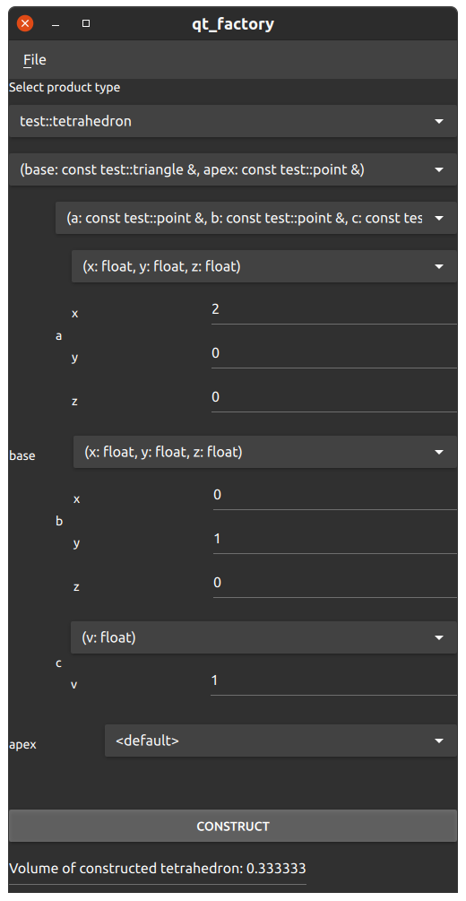
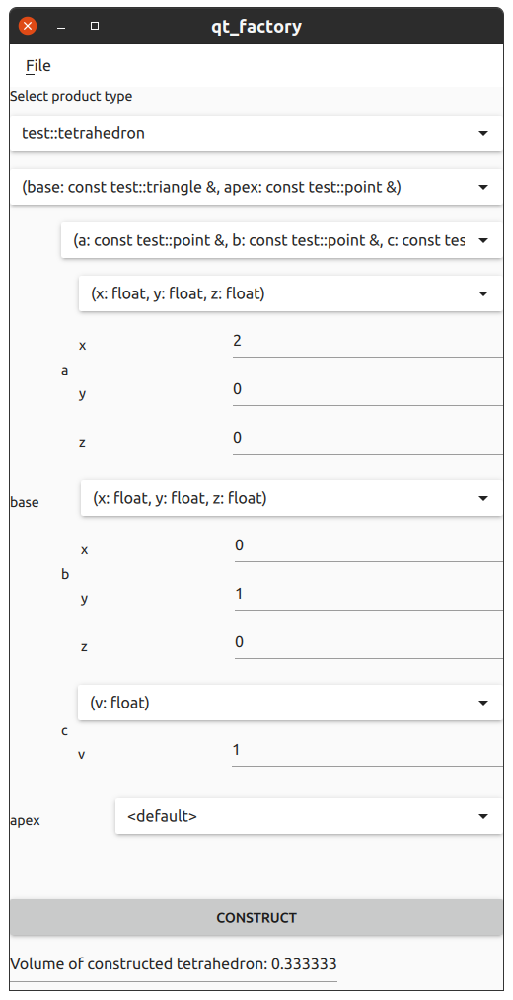

Qt5-based factory generator example
===================================

This example shows how to use a reflection-based factory builder to automatically
generate GUI windows that can select constructors to be used, take
the constructor parameter values and construct instances of almost arbitrary
types.

Building
--------

Make sure the required packages are installed:

::

 sudo apt install \
  qt5-default \
  qtdeclarative5-dev \
  qml-module-qtquick-controls \
  qml-module-qtquick-controls2

Do the following in the current directory:

::

 mkdir _build
 cd _build
 qmake ..
 make

Output
------

The generated GUI windows look like this:

|QT Factory dark|
|QT Factory light|

License
-------

The code in this sub-directory is licensed under the GNU GENERAL PUBLIC LICENSE
version 3, available at
[http://www.gnu.org/licenses/gpl-3.0.txt](http://www.gnu.org/licenses/gpl-3.0.txt).

